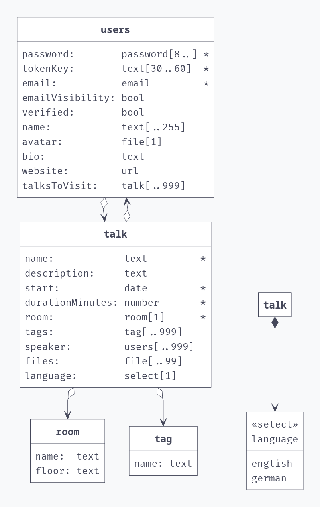

# Socrates fahrplan

This is a demo project for the socrates unconference 2025, to showcase the power of pocketbase as a backend with a modern sveltekit frontend.

Here are the main bullet points
* User edit page where you can change your email, emailVisible, password, avatar, bio, website, talksToVisit. 
* Users can only register if they post the secret "socrates2025" in the body.
* User component that is embedded in a talk page.
* Talk edit/create page where you can put a 
  * Name, startTime, duration (nonempty)
  * Description
  * speakers (multi-relation to user)
  * room (relation to room), nonempty
  * tags (multi-relation to tag)
  * files (multi-file)
  * language (select of "de" or "en")

# Step 1:
Create db entities in pocketbase:

* Create room table (read+list all)
* Create tag table (read+list all)
* Create talk (read+list all, create logged in, update own talk + speakerless talk, delete own talk + speakerless talk)
* Talk update+delete rule: `speaker ?= @request.auth.id || speaker:length = 0`
* Modify user: New fieldsA: bio, website, talksToVisit. Unique constraint name + Auth with username + create rule `@request.body.secret = 'socrates2025'`

Visualize the result with [Pocketbase-uml](https://pocketbase-uml.github.io/)

This automatically created us the migrations
* [1758554690_created_tag.go](pocketbase/migrations/1758554690_created_tag.go)
* [1758554722_created_room.go](pocketbase/migrations/1758554722_created_room.go)
* [1758555389_created_talk.go](pocketbase/migrations/1758555389_created_talk.go)
* [1758555583_updated_users.go](pocketbase/migrations/1758555583_updated_users.go)

# Further docs

This project is based on the [pocketbase-sveltekit-static](https://github.com/Egor-S/pocketbase-sveltekit-static) repo. The original readme is at [README.template.md](./README.template.md).

If you want to contribute (AI or human), read the [rules.md](./rules.md).
