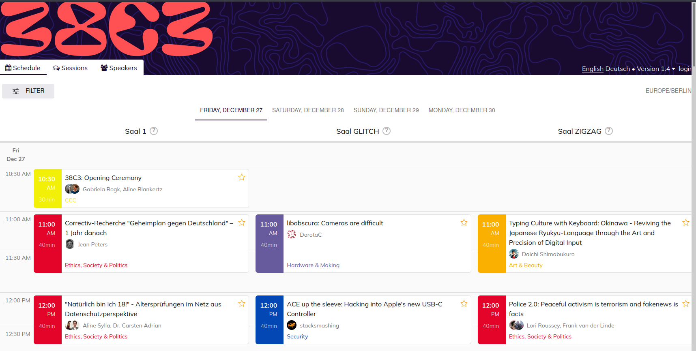
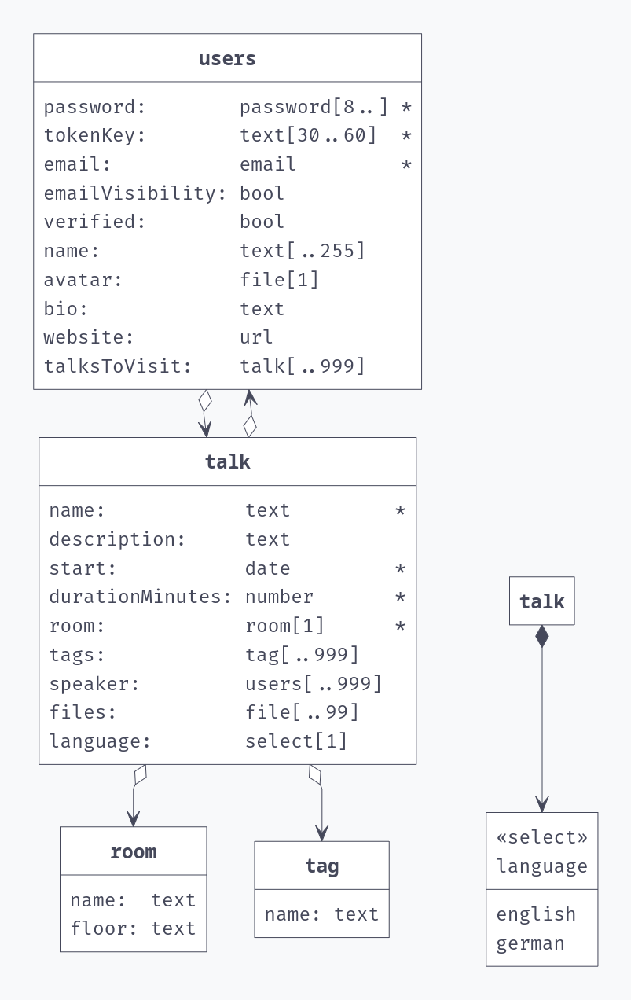
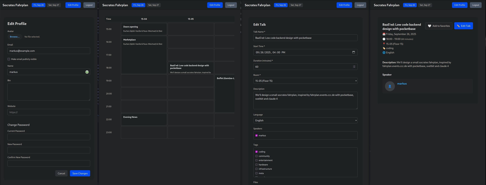

# Talk structure

1. About me
2. Classic Backend Development with java, and why it sucks
3. Backend-as-a-Service landscape
4. Building a complete conference schedule management system
    1. Architecture
    2. Backend + Data Structure
    3. Frontend Development
    4. Data Population Scripts
    5. Advanced Validation Hooks
5. Key Takeaways

---

# About Me

**Markus Vogl**

- Student @ JKU
- Java Full Stack Engineer since too long
- Discord: #rnbwdsh#0022
- Passionate about modern development tools and rapid prototyping
- Building efficient solutions with minimal overhead
- Template, talk and project under [https://github.com/rnbwdsh/socrates-fahrplan/](https://github.com/rnbwdsh/socrates-fahrplan/)
- Project + doc is in `fahrplan` branch, main branch is a template

---

# Classic Backend Development: The Controller Layer

```java

@RestController
@RequestMapping("/api/talks")
public class TalkController {
    @Autowired
    private TalkService talkService;

    @GetMapping
    public List<Talk> getAllTalks() {
        return talkService.findAll();
    }

    @PostMapping
    public Talk createTalk(@RequestBody Talk talk) {
        return talkService.save(talk);
    }
}
```

---

# Classic Backend Development: Service

```java

@Service
public class TalkService {
    @Autowired
    private TalkRepository talkRepository;

    public List<Talk> findAll() {
        return talkRepository.findAll();
    }

    public Talk save(Talk talk) {
        validateTalk(talk);
        return talkRepository.save(talk);
    }
}
```

---

# Classic Backend Development: Repository

```java

@Repository
public interface TalkRepository extends JpaRepository<Talk, Long> {
    List<Talk> findByRoomAndStartTimeBetween(
            String room, LocalDateTime start, LocalDateTime end);
}
```

---

# Classic Backend Development: Configuration Hell

```java

@Configuration
@EnableWebSecurity
public class SecurityConfig {
    @Bean
    public SecurityFilterChain filterChain(HttpSecurity http) {
        return http.authorizeHttpRequests(auth ->
                      auth.requestMatchers("/api/talks").authenticated())
                .oauth2Login(Customizer.withDefaults())
                .build();
    }
}
```

# Classic Backend Development: Even more

* Interfaces
* Unit tests
* Integration tests
* Configuration
* Logging
* Authorization and Authentication
* application.yml, pom.xml, Dockerfile, k8s manifests, CI/CD pipelines...

---

# Why Backend-as-a-Service for Developers

* **API Generation:** REST + GraphQL from schema definition
* **Database:** Integrated with automatic migrations
* **Authentication:** OAuth2, JWT, role-based access control
* **Real-time:** WebSocket subscriptions without manual setup
* **Developer Experience:** Focus on business logic, not boilerplate
* **Batteries Included:** Ready to use features out of the box

---

# FOSSS BaaS Landscape

| Product            | Core Lang  | Database           | Notable                   |
|--------------------|------------|--------------------|---------------------------|
| **Supabase**       | TS / MDX   | PostgreSQL         | 89k GitHub stars          |
| **Appwrite**       | PHP        | MySQL/MariaDB      | UI stuff                  |
| **Hasura**         | Haskell    | PostgreSQL         | GraphQL-first             |
| **Directus**       | Node.js/TS | Any SQL            | CMS focus                 |
| **Parse Platform** | Node.js    | MongoDB/PostgreSQL | True FOSSS                |
| **Kuzzle**         | Node.js    | Elasticsearch      | IoT/Analytics             |
| **PocketBase**     | Go         | SQLite             | Single executable, simple |

## Standard Features

OAuth2, Real-time subscriptions, File uploads, Role-based permissions, Admin UI, Multiple frontend SDKs

---

\section{Shut up and build a complete conference management system}

---

# Step 1: Architecture: Frontend (SvelteKit)

- Responsive grid-based schedule view
- Real-time updates across all clients
- Views for talks and users
- Serverside + clientside favorite talks
- Talk editing for speakers
- User profiles
- Vibes

--- 

# Example: fahrplan.events.ccc.de



# Step 1: Architecture: Backend

## Pocketbase

- Golang is like non-stupid C
- SQLite is super fast and easy for a single server
- Svelte admin UI -> steal logic
- Made by some guy in Bulgaria (ganigeorgiev)

## Features

- RESTful API with permissions
- Real-time WebSocket subscriptions
- File uploads for talk materials
- Talks, Users/Speakers, Rooms, Tags
- Validation hooks to showcase custom logic

**DevOps:**

- Build a docker-container, host with pocketbase webserver
- Automated data population scripts

---

# Step 2: Backend + Data Structure - Database Design with PocketBase

Created 4 main collections:

* **Room** {name, floor} - (read+list all)
* **Tag** {name} - (read+list all)
* **Talk** {name, description, duration, speaker, room, tags} - custom
* **User** standard + {bio, website, talksToVisit} + login with username - (default + secret)

You can set per-table, per-operation permissions, i.e.

* UPDATE permission on talk `speaker ?~ @request.auth.id || speaker:length = 0`
* CREATE permission on user `@request.body.secret = 'socrates2025'`

**Result:** Automatic REST API + Admin UI generated!

---

# Step 2: Generated Migrations from UI changes

```go
func init() {
m.Register(func (app core.App) error {
jsonData := `{
            "createRule": "@request.auth.id != \"\"",
            "deleteRule": "speaker ?~ @request.auth.id || speaker:length = 0",
            "fields": [
                {"name": "name", "type": "text", "required": true},
                {"name": "start", "type": "date", "required": true},
                {"name": "durationMinutes", "type": "number", "required": true},
                {"name": "room", "type": "relation", "required": true},
                {"name": "speaker", "type": "relation", "maxSelect": 999}
            ]
        }`
})
}
```

---

# Step 2: Data Structure Visualization - Pocketbase-UML



---

# Step 3: Frontend Development: SvelteKit + TypeScript + Svelte 5 Runes

Key architectural decisions:

* **Type Safety:** Generated types from PocketBase schema
* **Real-time:** WebSocket subscriptions to collections
* **State Management:** Svelte stores for favorites
* **Responsive Design:** CSS Grid layout for talk schedule

```typescript
import type {TalkResponse} from '$lib/pocketbase-types';

pb.collection('talk').subscribe('*', (e) => {
    talks.update(current => [...current, e.record]);
});
```

---

# Excursion: Vibecoding for haters

* Have a rules.md, i.e.
    * Keep the codebase minimal, clean and readable. Don't comment obvious things, i.e. `// Store for all talks` before `export const talks = writable<TalkResponse[]>([]);`
    * Inline variables and functions that are only used once, but try to create helper functions for 3x+ repeating patterns.

* Plan your tasks in steps, i.e.
    * The base page should be visible to everyone, even when not logged in.
    * Non-logged in users can favourite talks to their svelte-persisted-store, logged in users can favourite talks to their user.talksToVisit field.
    * The login page needs a secret field.

* A good spec is half the documentation
* If possible, pull just the needed stuff into context, or let it refine the planning before starting.
* Still use git!

---

# Step 3: Smart Permission Integration

## Frontend Rules Mirror Backend Permissions

```typescript
const canEdit = (talk: TalkResponse, user: UserResponse) =>
    talk.speaker?.includes(user.id) || talk.speaker?.length === 0;

if ($currentUser) {
    await pb.collection('users').update($currentUser.id, {
        talksToVisit: [...($currentUser.talksToVisit || []), talkId]
    });
} else {
    favoriteStore.update(favs => [...favs, talkId]);
}
```

**Result:** Seamless user experience with proper authorization!

---

# Step 3: Screenshot



---

# Step 4: Data Population Scripts - Node.js Scripts for Data Management

```javascript
import PocketBase from 'pocketbase';

const pb = new PocketBase('http://127.0.0.1:8090');

async function insertData() {
    await pb.admins.authWithPassword('admin@admin.at', 'adminadmin');
    const rooms = [
        {name: '15-04', floor: '15'},
        {name: '15-05', floor: '15'},
    ];
    for (const room of rooms) {
        await pb.collection('room').create(room);
    }
}
```

**Benefits:** Repeatable data setup, easy testing, version-controlled seed data

---

# Step 5: Advanced Validation Hooks - Go Hooks for Business Logic

```go
app.OnRecordBeforeCreateRequest("talk").Add(func (e *core.RecordCreateEvent) error {
  start := e.Record.GetDateTime("start")
  duration := e.Record.GetInt("durationMinutes")
  room := e.Record.GetString("room")

  existingTalks, err := app.Dao().FindRecordsByExpr("talk",
  dbx.HashExp{"room": room})

  for _, existing := range existingTalks {
    if hasTimeOverlap(start, duration, existing) {
      return errors.New("Talk conflicts with existing schedule")
	}
  }
  return e.Next()
})
```

---

# Step 5: Conflict Detection Logic - Smart overlap prevention

```go
func hasTimeOverlap(newStart time.Time, newDuration int, existing *models.Record) bool {
  existingStart := existing.GetDateTime("start")
  existingDuration := existing.GetInt("durationMinutes")

  newEnd := newStart.Add(time.Duration(newDuration) * time.Minute)
  existingEnd := existingStart.Add(time.Duration(existingDuration) * time.Minute)

  return !(newEnd.Before(existingStart) || newStart.After(existingEnd))
}
```

**Testing:** Vibe coded 4 manual test cases for the 4 kinds of temporal overlap (start inside, end inside, enveloping, enveloped)

---

# Key Takeaways

* Full system in 1h backend, 2h frontend, 1h testing, 1h presentation / documentation
* Easily extendable with custom hooks or serverside-code for business logic
* No more boilerplate and json-shoveling
* There is a BaaS for you and your favourite language

---

\section{Thank You!}
    